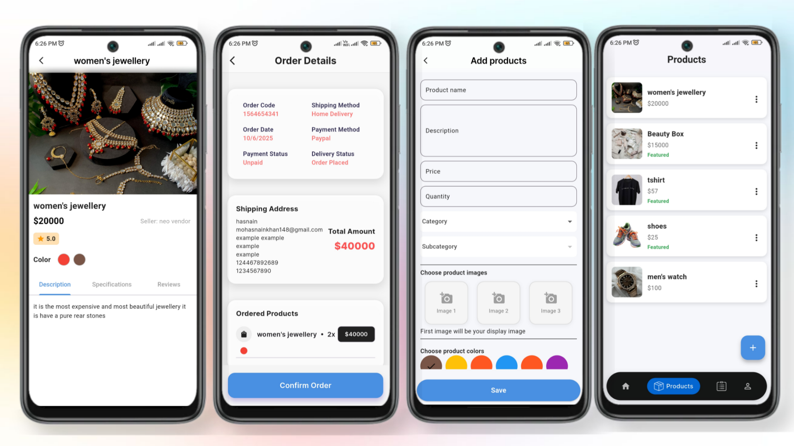
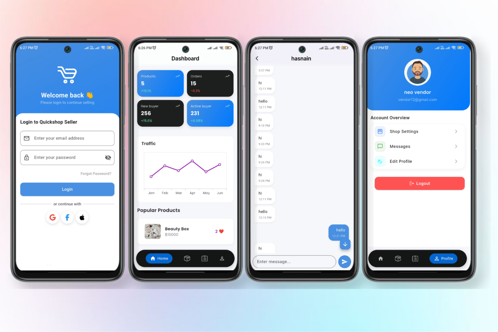
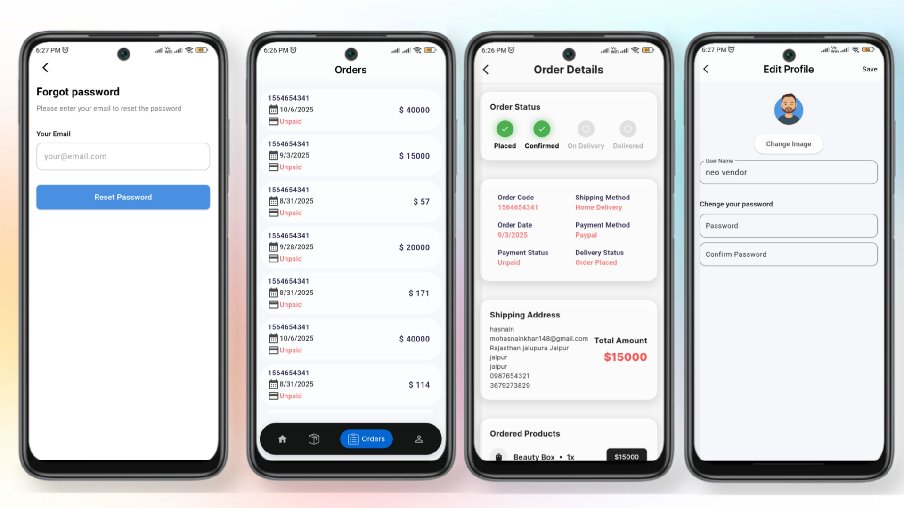
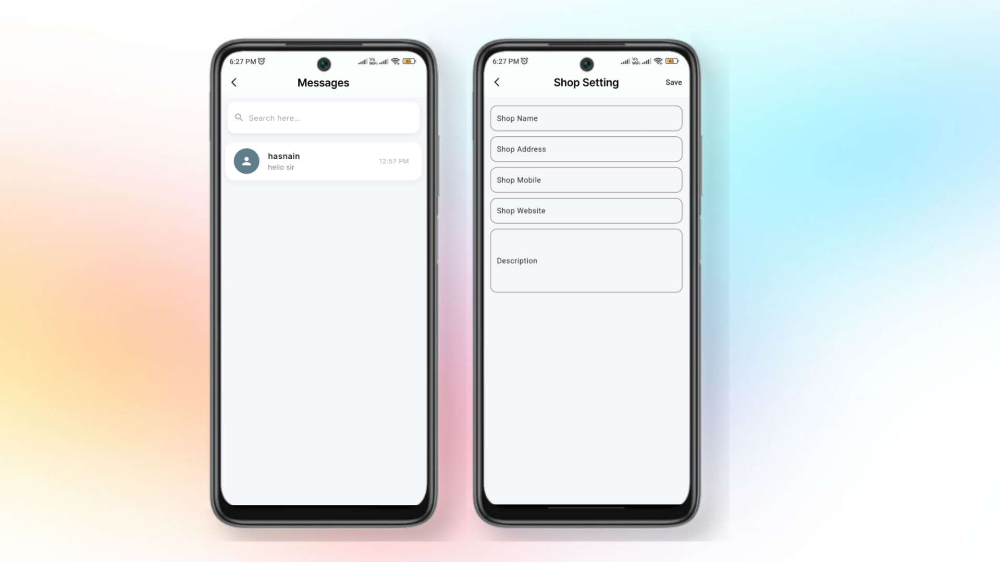

# 🛒 QuickshopSeller - Admin Panel

QuickshopSeller is the **admin panel** for managing products, users, and store operations in the Quickshop ecosystem. Built with Flutter and powered by Firebase, it enables sellers/admins to easily manage the backend of the shopping platform via a mobile application.

---

## 📱 Description

This Flutter application serves as the **admin-side app** of Quickshop. It allows store owners or sellers to:

- Add/edit/delete products
- Manage orders and users
- Upload and store product images via Cloudinary
- Use REST APIs for backend communication
- GetX for responsive state management

The app is designed to be fast, lightweight, and easy to use with a clean UI built using VelocityX.

---

## ✨ Features

- 🔐 Firebase Authentication
- 📦 Product management (Add, Edit, Delete)
- 🛍️ Order and customer tracking
- ☁️ Cloudinary integration for image uploads
- ⚡ Fast state management using GetX
- 🔁 REST API integration via `http`
- 🎨 Stylish UI with VelocityX
- 🔔 Real-time updates and alerts

---

## 🖼️ Screenshots

|   Ui |   Ui |   Ui |   Ui |
|:--------:|:----------:|:----------:|:----------:|
|  |  |  |   |


---

## 🚀 Getting Started

### ✅ Prerequisites

- Flutter SDK installed (>= 3.x.x)
- Android Studio or VS Code
- Firebase project setup
- Cloudinary account (for storing images)

### 🛠 Installation Steps

1. **Clone the Repository**
   ```bash
   git clone https://github.com/Hasnainkhan40/quickshop_seller
   cd quickshopseller

